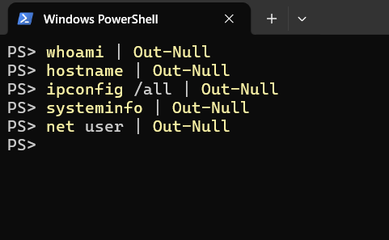
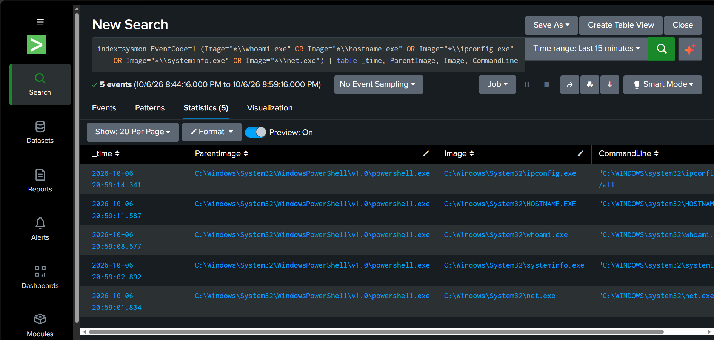
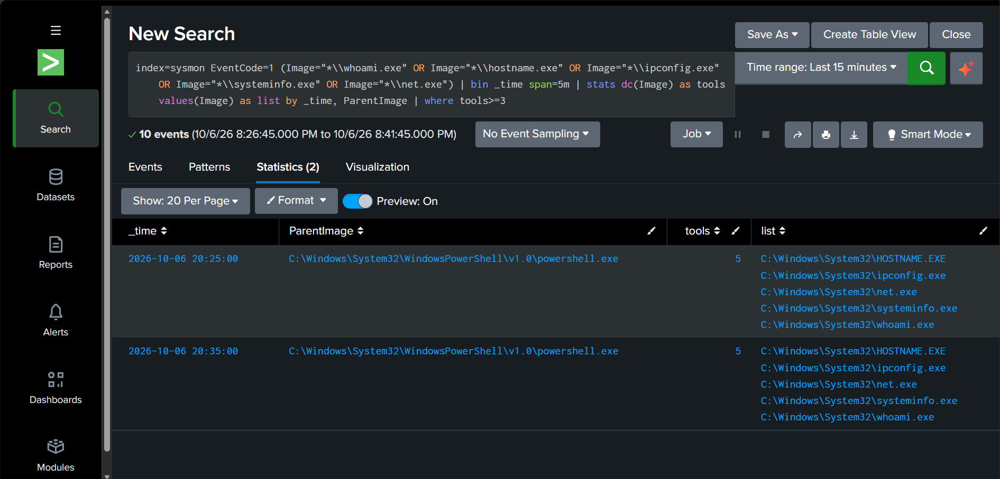

# Детект 01: разведка после взлома (Recon burst)

**MITRE ATT&CK:** T1033 (System Owner/User Discovery), T1016 (System Network Configuration Discovery), T1082 (System Information Discovery), T1087 (Account Discovery)

## Что имитируем
Атакующий, получивший доступ к машине, выясняет, кто он, где находится и какие есть учётные записи. Я запустил подряд из PowerShell: whoami, hostname, ipconfig /all, systeminfo, net user.



## Логика детекта
Одна разведывательная команда ничего не значит, администратор вводит их постоянно. Подозрительно, когда один родительский процесс за короткое время запускает несколько разных таких утилит. Детект считает количество разных программ из списка на каждого родителя в пятиминутном окне и срабатывает при трёх и более.

## Запрос (SPL)
```
index=sysmon EventCode=1 (Image="*\\whoami.exe" OR Image="*\\hostname.exe" OR Image="*\\ipconfig.exe" OR Image="*\\systeminfo.exe" OR Image="*\\net.exe") | bin _time span=5m | stats dc(Image) as tools values(Image) as list by _time, ParentImage | where tools>=3
```

## Что видно в логах
Сырые события Sysmon (EventCode=1) по каждой команде:



Результат детекта: родитель powershell.exe, 5 разных инструментов в одном окне:



## Ложные срабатывания
- Установщик Splunk запускал net.exe с параметрами вроде NT SERVICE\Splunkd через cmd.exe. Исключается через NOT CommandLine="*Splunkd*".
- Скрипты администраторов и системы инвентаризации выполняют те же команды.
- Мои собственные тренировочные запросы тоже срабатывали, поэтому в боевой среде детект стоит ограничивать по пользователям и хостам.

## Ограничения
- Окна фиксированные (bin span=5m): если серия команд попадёт на границу окна, она разделится и может не достичь порога. Лучше использовать скользящее окно (например, streamstats или transaction).
- Порог в 3 инструмента подобран вручную. Его нужно калибровать на реальной статистике.
- Детект не смотрит на параметры командной строки и контекст (время суток, пользователь).
